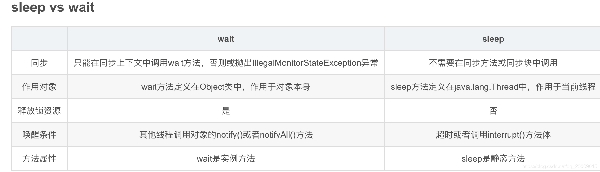

##` wait()和 sleep()的区别`
1. 来源于不同的父类：sleep()来自于 Thread类的静态方法，而 wait()方法来源于 Object类的成员方法
2. sleep()不会释放锁，也不需要占用锁。而 wait会释放锁。
3. 唤醒条件不同：wait()需要其他线程调用对象的 notify()或者 notifyAll()方法，而sleep()方法需要超时或者调用interrupt()方法体。
4. sleep()有可能会抛出异常，所以需要进行异常处理；wait()不需要处理。  
5. sleep()可以在任何地方使用；wait()只能在同步方法和同步代码块中使用

