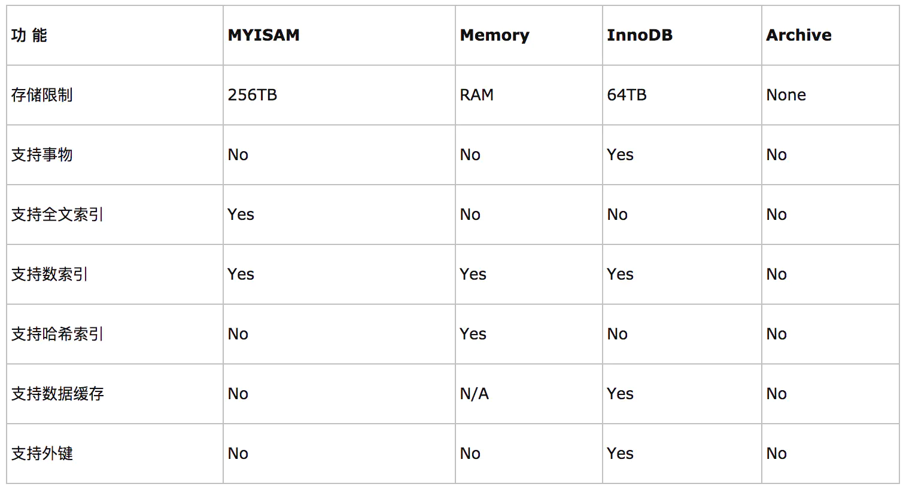

## MYSQL引擎的区别

如果要提供提交、回滚、崩溃恢复能力的事物安全（ACID兼容）能力，并要求实现并发控制，InnoDB是一个好的选择

如果数据表主要用来插入和查询记录，则MyISAM引擎能提供较高的处理效率

如果只是临时存放数据，数据量不大，并且不需要较高的数据安全性，可以选择将数据保存在内存中的Memory引擎，MySQL中使用该引擎作为临时表，存放查询的中间结果

如果只有INSERT和SELECT操作，可以选择Archive，Archive支持高并发的插入操作，但是本身不是事务安全的。Archive非常适合存储归档数据，如记录日志信息可以使用Archive
